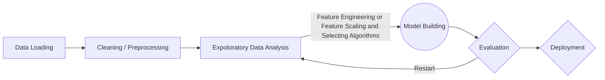
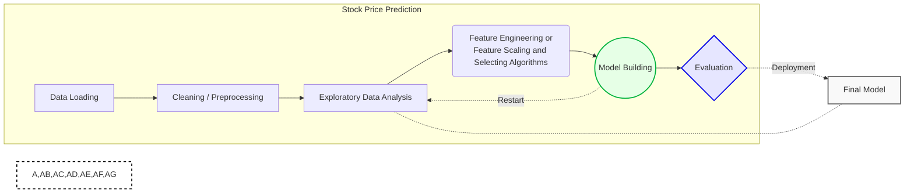

## Yes Bank Stock Closing Price Predictor

- Before starting to publish, you must link an account in the **Publish** sub-menu.

#### Frame

## About Project :
  The Indian financial domain has long been aware of Yes Bank, a prominent bank that has been the subject of much discussion since 2018, due to a fraudulent scheme involving Rana Kapoor. This illicit activity raises a pertinent question about how this event has affected the bank's stock prices, and whether reliable predictive models, such as Time series models, can accurately reflect such situations.

Our dataset includes monthly stock prices of Yes Bank since its inception, encompassing essential information regarding the closing, starting, highest, and lowest stock prices of each month. The primary objective of this study is to investigate and forecast the stock's closing price for each period, utilizing a range of analytical methods for the most accurate results.

## Abstract :
Accurately predicting stock market returns is inherently complex due to volatile and non-linear financial market dynamics. However, with the advent of machine learning, time series forecasting, and improved computational capabilities, predictive techniques have become increasingly efficient in forecasting stock prices.

In this study, we employ regression and time series forecasting methods to predict the closing price of a selected finance sector company for the following day. The financial data utilized includes the Open, High, Low, and Close prices of stocks, which were leveraged to generate new variables serving as inputs to the models.

The performance of our models was evaluated using standard strategic indicators, including Root Mean Square Error (RMSE) and Mean Absolute Percentage Error (MAPE). The attainment of low values in these metrics suggests the effectiveness of our models in predicting stock closing prices.

  #### **To improve performance in predicting the monthly stock's closing price of Yes Bank, we first extracted and categorized the bank's data to identify and analyze behavioral patterns. Our team leveraged this dataset in a Supervised Machine Learning-Regression project to uncover critical insights for predicting stock prices more accurately.**

  #### **Through careful analysis, we discovered several pertinent trends and patterns, which helped inform our predictive models and resulted in improved performance. By leveraging these insights, we were able to develop a more robust and comprehensive understanding of Yes Bank's financial stock trends, which ultimately enabled us to create more reliable and accurate predictions for future stock closing prices.**
  
  ### 📑 About The Dataset : data_YesBank_StockPrices - contains observations regarding Open, Close, High, and Low Prices of the Yes Bank stock from July 2005 to November 2020.
  
<table>
  <th style='background: black;color:white ;padding:5px 10px'>Columns</th>
  <th style='background: black;color:white ;padding:5px 10px'>Summary</th>
  
  <tr style='text-align:center'>
    <td style='padding:7px 10px'>Open</td>
    <td style='padding:7px 10px'>Open means the price at which a stock started trading that month.</td>
  </tr>
  
   <tr style='text-align:center'>
    <td style='padding:7px 10px'>High</td>
    <td style='padding:7px 10px'>refers to the maximum price that month.</td>
  </tr>
  
   <tr style='text-align:center'>
    <td style='padding:7px 10px'>Low</td>
    <td style='padding:7px 10px'>refers to the minimum price that month.</td>
  </tr>
  
   <tr style='text-align:center'>
    <td style='padding:7px 10px'>Close</td>
    <td style='padding:7px 10px'>refers to the final trading price for that month, which we have to predict using regression technique.</td>
  </tr>
  
   <tr style='text-align:center'>
    <td style='padding:7px 10px'>No of Rows</td>
    <td style='padding:7px 10px'>185</td>
  </tr>
  
   <tr style='text-align:center'>
    <td style='padding:7px 10px'>No of Columns</td>
    <td style='padding:7px 10px'>5</td>
  </tr>
  
   <tr style='text-align:center'>
    <td style='padding:7px 10px'>Date</td>
    <td style='padding:7px 10px'>Time Series Data for perticular Month</td>
  </tr>
</table>

#### Objective : 

The primary aim of this project is to forecast the closing price of Yes Bank stocks for a given month. This undertaking entails a comprehensive analysis of the Yes Bank data set, which will involve several critical steps to ensure accurate predictions.
To achieve this objective, we will employ various analytical techniques, including statistical analysis and machine learning algorithms. By leveraging a combination of these methods, our findings will enable us to make more precise predictions for Yes Bank stock's closing price, ultimately benefiting investors and financial professionals.

#### The Path : 

